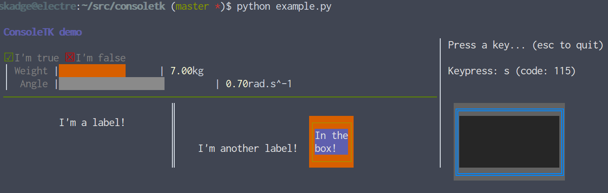

ConsoleTK
=========

ConsoleTK is a simple, stand-alone Python class to draw colorful command-line interfaces.
Think 'curses for dummies'.



To draw your interface, you first place your cursor with `moveto(x,y)` (or `relmoveto(x,y)` 
for a relative motion), and you then draw a widget: label, bars, separators, etc.

ConsoleTK also implements *non-blocking polling of the keyboard* (including
arrow keys) that enables user interactions.

Note that ConsoleTK requires a terminal emulator that supports ANSI sequences and 256 colours.

Example
-------

The interface pictured above is generated with the following code (see
[example.py](example.py) for the complete example, including reading
the keyboard):

```python
import consoletk

with consoletk.ConsoleTK(height=20) as c:

    # Title
    c.label("ConsoleTK demo", fg="violet",bold=True)

    # Tickboxes
    c.relmoveto(0,2)
    c.boolean(True, "I'm true")

    c.relmoveto(11,0)
    c.boolean(False, "I'm false")

    # Progress bars
    c.moveto(0,3)
    c.vsep(2)
    c.moveto(2,3)
    c.absolutebar(7, 10, "kg", 
                  label = "Weight", 
                  maxlength = 20, 
                  autocolor = True, 
                  highishot = True)

    c.moveto(2,4)
    c.absolutebar(0.7, 1, 
                  "rad.s^-1", 
                  label = " Angle")

    # Separators and labels
    c.moveto(0,5)
    c.hsep(78, fg="green")

    c.moveto(30,6)
    c.vsep(5, double=True)

    c.relmoveto(-20,1)
    c.label("I'm a label!")

    c.relmoveto(25,2)
    c.label("I'm another label!")

    # A box
    c.relmoveto(20,-2)
    c.box(8,4,border_fg="yellow",border_bg="orange",bg="violet")

    c.relmoveto(1,1)
    c.label("In the",bg="violet")
    c.relmoveto(0,1)
    c.label("box!",bg="violet")

    # ...and more of it...!
    c.moveto(78,1)
    c.vsep(10)

    c.moveto(80,1)
    c.label("Press a key... (esc to quit)")

    console.relmoveto(1,5)
    console.box(20,6,"blue","base00",bg="base02",double=True)
```

Initialization
--------------

Simply create a canvas with:

```python
import consoletk

with ConsoleTK(height=20) as console:
    #...
```

Obviously, change the height to your liking.
The width of the area is the current width of the terminal. Note that ConsoleTK
does not perform any form of reflow if you change the geometry of your
interface.

Note that the cursor is initially at position `(1,1)` (and not `(0,0)`) to leave a small margin.
You can still move to `(0,0)` with `console.moveto(0,0)`.

Colours
-------

Many widgets can take as parameter foreground (`fg`) and background (`bg`) colours.

In its current version, ConsoleTK uses a system of colour palettes, and as such,
colours must be one of:

- `yellow`
- `orange`
- `red`  
- `magenta`
- `violet`
- `blue` 
- `cyan` 
- `green`
- `base03` (black)
- `base02` (almost black)
- `base01` (darker grey)
- `base00` (dark grey)
- `base0` (grey)
- `base1` (light grey)
- `base2` (very light)
- `base3` (white)

Besides, you can also often specify `bold=True` and `blink=True` to enable the
corresponding effects (effective rendering depends on your terminal).

Motions
-------

You can move your cursor with `moveto(x,y)` or `relmoveto(x,y)`.
You can also save and restore a previous position with `savepos()` and `restorepose()`.

Widgets
-------

*See each methods' documentation inside `consoletk` for the details*

- Labels: `label(text, fg, bg, bold, blink)`
- Lines: `vsep(height)`, `hsep(width)`
- Tickboxes: `boolean(state,label)`
- Horizontal progressbars: `bar(...)` and `absolutebar(...)`

Note that **drawing a widget does not move the cursor**: the cursor remains where it was before you
issued the drawing call.

Others
------

- `clear()` clears the entire interface.
- `clear(width, height)` clears a rectangle below the cursor.
- `get_keypress()` returns the last key pressed (or `ConsoleTK.ARROW_LEFT|RIGHT|UP|DOWN` for the
arrows).

